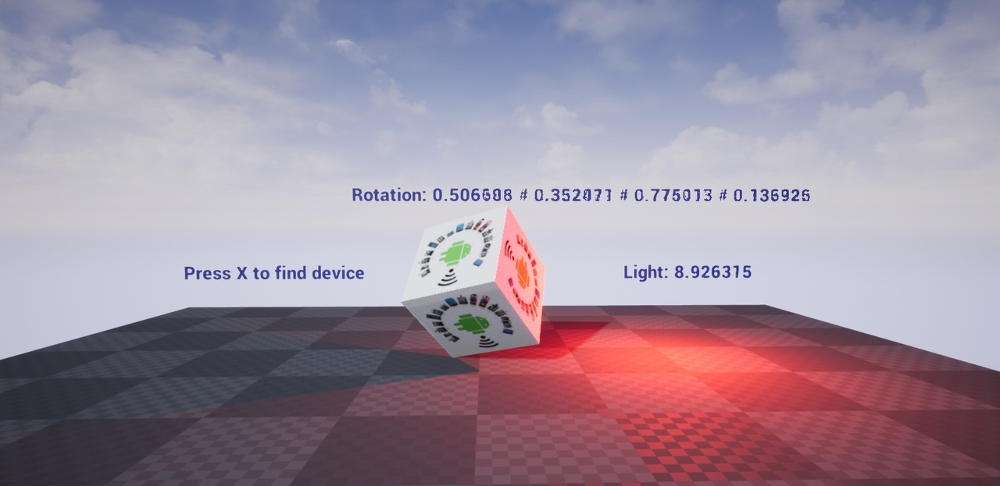
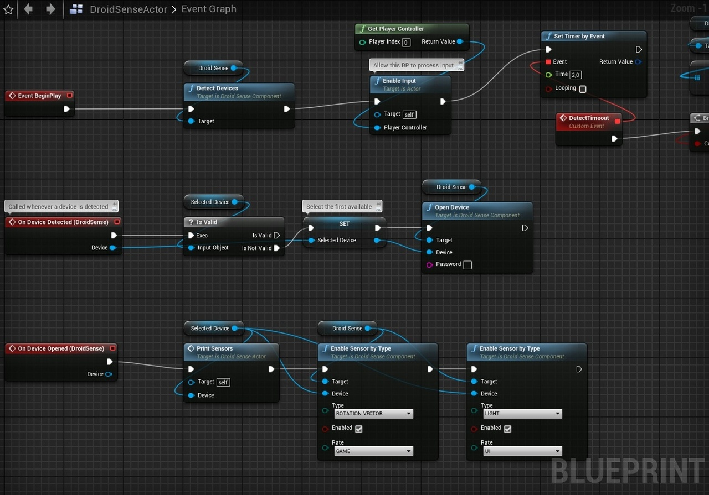

# UE4 DroidSense plugin

Connect to any android based device and read the sensors data in real-time over Wi-Fi/UDP.

Requires companion app to be installed on device:
https://play.google.com/store/apps/details?id=com.wongfei.sensorbroadcaster

More about sensors:
https://source.android.com/devices/sensors/sensor-types

## Usage

